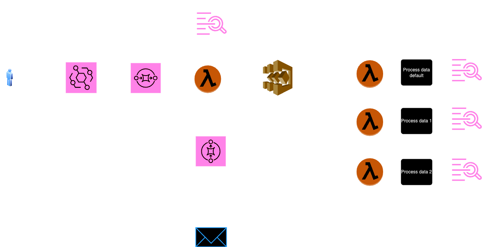

# Event-Driven Architecture with AWS

## Project Overview

This project implements an event-driven architecture using various AWS services to process events efficiently. The architecture leverages Amazon EventBridge, Amazon SQS, AWS Lambda, Step Functions, and CloudWatch for monitoring.

## Architecture Flow

1. **Event Submission**: Users send events to **EventBridge**.
2. **SQS Trigger**: EventBridge triggers an **SQS** queue.
3. **Lambda Function**: The SQS queue triggers the Lambda function named `lambda_start_step_function`.
   - If this Lambda function fails, it sends a message to a Dead Letter Queue (DLQ), which then notifies subscribers via email.
   - If the function succeeds, it triggers an **AWS Step Function**.
4. **Step Function Choices**: The Step Function includes a choice state:
   - **Choice 1**: Triggers `lambda_choice_1`.
   - **Choice 2**: Triggers `lambda_choice_2`.
   - **Default Choice**: Triggers `lambda_default_choice`.
5. **Event Processing**: Each of the three Lambda functions processes the event.
6. **Logging**: All Lambda functions log their execution details to CloudWatch for monitoring and debugging purposes.

## Architecture Diagram

## AWS Services Used

- **Amazon EventBridge**: For event routing.
- **Amazon SQS**: For decoupled message queuing.
- **AWS Lambda**: For serverless compute functions.
- **AWS Step Functions**: For orchestrating workflows.
- **Amazon CloudWatch**: For logging and monitoring.

## Getting Started

### Prerequisites

- AWS account
- Jenkins configured for CI/CD
- AWS CLI configured
- Jenkins pipeline setup to deploy the project

### Deployment

This project uses a Jenkins pipeline for deployment.
